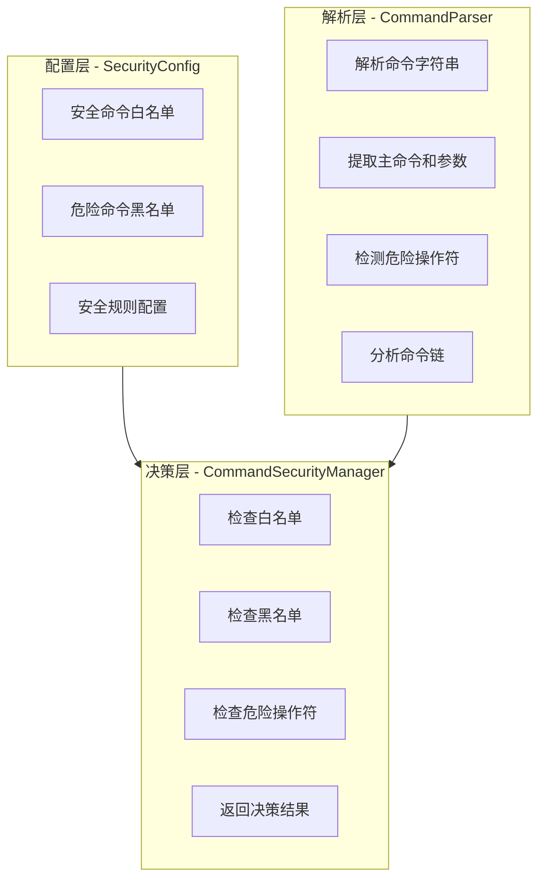
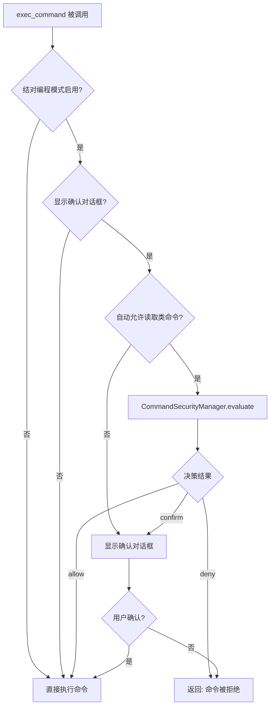
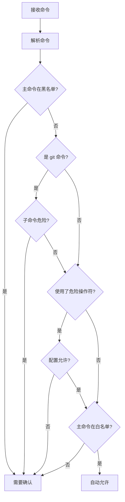

# 自动允许读取/查询类命令功能设计

## 需求概述

在启用"确认执行命令对话框"时，新增选项让用户可以选择是否自动允许读取、查询类命令，减少不必要的确认弹窗。

## 功能范围

- **生效工具**：仅 `exec_command` 终端命令执行
- **自动允许的工具**：`abort_command`（中止命令不需要确认）
- **不受影响**：SFTP 工具、Tab 管理工具

## 架构设计（参考 Chaterm）

采用三层架构实现命令安全控制：



### 层次职责

| 层次 | 文件 | 职责 |
|------|------|------|
| 配置层 | `CommandSecurity.ts` | 定义安全命令列表、危险命令黑名单、安全规则 |
| 解析层 | `CommandParser.ts` | 解析命令结构、检测管道/重定向/命令链 |
| 决策层 | `CommandSecurityManager.ts` | 综合判断命令安全性，返回决策结果 |

## 配置项设计

### 新增配置项

在 `pairProgrammingMode` 下新增：

```typescript
pairProgrammingMode: {
    enabled: boolean;
    showConfirmationDialog: boolean;
    autoFocusTerminal: boolean;
    // 新增配置项
    autoAllowReadCommands: boolean;      // 自动允许读取/查询类命令
    commandSecurity: {
        allowSudo: boolean;               // 是否允许 sudo 命令自动执行
        allowPipes: boolean;              // 是否允许管道操作自动执行
        allowRedirects: boolean;          // 是否允许重定向操作自动执行
        allowCommandChains: boolean;      // 是否允许命令链 (&& ||) 自动执行
    };
}
```

### 配置逻辑

| enabled | showConfirmationDialog | autoAllowReadCommands | 行为 |
|---------|------------------------|----------------------|------|
| false   | -                      | -                    | 无确认，直接执行 |
| true    | false                  | -                    | 无确认，直接执行 |
| true    | true                   | false                | 所有命令都需确认 |
| true    | true                   | true                 | 读取/查询类命令自动允许，其他需确认 |

## 第一层：安全配置 (SecurityConfig)

### 安全命令白名单

```typescript
export const SAFE_COMMANDS = new Set([
    // 文件/目录查看
    'ls', 'dir', 'll', 'la', 'l', 'lh', 'ltr',
    'cat', 'head', 'tail', 'less', 'more', 'bat', 'zcat',
    'file', 'stat', 'du', 'df', 'tree', 'find', 'locate',
    
    // 文本查看/搜索
    'grep', 'egrep', 'fgrep', 'rg', 'ag', 'ack',
    'sed', 'awk', 'wc', 'sort', 'uniq', 'cut', 'tr',
    'head', 'tail', 'strings',
    
    // 系统信息
    'pwd', 'whoami', 'who', 'w', 'id', 'groups',
    'uname', 'hostname', 'uptime', 'date', 'cal', 'time',
    'env', 'printenv', 'echo', 'printf', 'type',
    
    // 进程/资源查看
    'ps', 'top', 'htop', 'btop', 'glances', 'atop',
    'free', 'vmstat', 'iostat', 'mpstat', 'lscpu',
    
    // 网络（仅查看）
    'ping', 'traceroute', 'tracepath', 'mtr', 'nmap',
    'netstat', 'ss', 'ip', 'ifconfig', 'iwconfig',
    'curl', 'wget', 'httpie', 'http',
    'dig', 'nslookup', 'host', 'whois', 'nc', 'telnet',
    
    // 版本/帮助
    'version', 'help', 'man', 'info', 'tldr', 'whatis', 'apropos',
    
    // Git 查看类命令（仅查看操作）
    'git',  // 需要进一步检查子命令
    
    // JSON/YAML 处理
    'jq', 'yq', 'xq', 'tomlq', 'jc',
    
    // 校验/编码
    'md5sum', 'sha1sum', 'sha256sum', 'sha512sum', 'b3sum',
    'base64', 'base32', 'xxd', 'od', 'hexdump',
    
    // 比较/差异
    'diff', 'sdiff', 'vimdiff', 'colordiff', 'cmp',
    
    // 其他安全命令
    'history', 'alias', 'which', 'whereis',
    'exa', 'fd', 'fzf', 'sk', 'fzy', 'peco',
    'lsd', 'broot', 'nnn', 'ranger',
    'cd', 'pushd', 'popd', 'dirs',  // 目录切换
]);
```

### 危险命令黑名单

```typescript
export const DANGEROUS_COMMANDS = new Set([
    // 文件删除
    'rm', 'rmdir', 'shred', 'wipe',
    
    // 磁盘操作
    'dd', 'mkfs', 'fdisk', 'parted', 'gparted', 'format',
    
    // 权限修改
    'chmod', 'chown', 'chgrp',
    
    // 用户管理
    'useradd', 'userdel', 'usermod', 'passwd',
    'groupadd', 'groupdel', 'groupmod',
    
    // 系统控制
    'shutdown', 'reboot', 'poweroff', 'halt', 'init',
    'systemctl', 'service', 'journalctl',
    
    // 进程控制
    'kill', 'pkill', 'killall', 'xkill',
    
    // 网络防火墙
    'iptables', 'ip6tables', 'ufw', 'firewall-cmd', 'nft',
    
    // 包管理器
    'apt', 'apt-get', 'aptitude', 'dpkg',
    'yum', 'dnf', 'rpm', 'zypper',
    'pacman', 'yay', 'paru',
    'npm', 'yarn', 'pnpm', 'bower',
    'pip', 'pip3', 'conda', 'poetry',
    'cargo', 'go', 'gem', 'composer',
    'brew', 'choco', 'scoop',
    
    // 容器/编排
    'docker', 'podman', 'kubectl', 'helm', 'docker-compose',
    
    // 远程执行
    'ssh', 'scp', 'rsync', 'sftp',
    
    // 其他危险命令
    'crontab', 'at', 'batch',
    'openssl', 'gpg',
    'mysql', 'psql', 'mongo', 'redis-cli',  // 数据库
]);
```

### Git 子命令分类

```typescript
export const SAFE_GIT_SUBCOMMANDS = new Set([
    'status', 'log', 'diff', 'show', 'blame', 'annotate',
    'branch', 'tag', 'remote', 'stash',  // 仅查看列表
    'ls-files', 'ls-tree', 'ls-remote',
    'reflog', 'rev-list', 'rev-parse',
    'describe', 'shortlog', 'name-rev',
]);

export const DANGEROUS_GIT_SUBCOMMANDS = new Set([
    'add', 'commit', 'push', 'pull', 'fetch',
    'merge', 'rebase', 'reset', 'checkout',
    'cherry-pick', 'revert', 'clean',
    'stash',  // stash push/pop
    'branch',  // branch -d
    'tag',  // tag -d
    'remote',  // remote add/rm
]);
```

### 危险操作符

```typescript
export const DANGEROUS_OPERATORS = {
    PIPE: '|',           // 管道
    REDIRECT_OUT: '>',   // 重定向输出
    REDIRECT_APPEND: '>>',
    REDIRECT_IN: '<',    // 重定向输入
    AND: '&&',           // 命令链 AND
    OR: '||',            // 命令链 OR
    BACKGROUND: '&',     // 后台运行
    SUBSHELL: '$()',     // 子 shell
    COMMAND_SUBST: '`',  // 命令替换
};
```

## 第二层：命令解析器 (CommandParser)

### 解析结果接口

```typescript
interface ParsedCommand {
    original: string;           // 原始命令
    mainCommand: string;        // 主命令
    arguments: string[];        // 参数列表
    hasSudo: boolean;           // 是否使用 sudo
    hasPipes: boolean;          // 是否包含管道
    hasRedirects: boolean;      // 是否包含重定向
    hasCommandChains: boolean;  // 是否包含命令链
    subCommands: string[];      // 管道/命令链中的子命令
    operators: string[];        // 使用的操作符列表
}
```

### 解析逻辑

```typescript
class CommandParser {
    parse(command: string): ParsedCommand {
        const result: ParsedCommand = {
            original: command,
            mainCommand: '',
            arguments: [],
            hasSudo: false,
            hasPipes: false,
            hasRedirects: false,
            hasCommandChains: false,
            subCommands: [],
            operators: [],
        };
        
        // 1. 检测危险操作符
        result.hasPipes = command.includes('|');
        result.hasRedirects = /[<>]/.test(command);
        result.hasCommandChains = /&&|\|\|/.test(command);
        
        // 2. 提取主命令
        let tokens = this.tokenize(command);
        if (tokens[0] === 'sudo' || tokens[0] === 'doas') {
            result.hasSudo = true;
            tokens = tokens.slice(1);
        }
        
        result.mainCommand = tokens[0] || '';
        result.arguments = tokens.slice(1);
        
        // 3. 提取管道中的所有子命令
        if (result.hasPipes) {
            result.subCommands = command.split('|')
                .map(cmd => this.extractFirstCommand(cmd.trim()));
        }
        
        return result;
    }
    
    private tokenize(command: string): string[] {
        // 简单的分词，处理引号
        // TODO: 更完善的解析
        return command.trim().split(/\s+/);
    }
    
    private extractFirstCommand(cmd: string): string {
        const tokens = this.tokenize(cmd);
        if (tokens[0] === 'sudo' || tokens[0] === 'doas') {
            return tokens[1] || '';
        }
        return tokens[0] || '';
    }
}
```

## 第三层：安全决策管理器 (CommandSecurityManager)

### 决策结果

```typescript
type SecurityDecision = 
    | { action: 'allow'; reason: string }      // 自动允许
    | { action: 'confirm'; reason: string }    // 需要确认
    | { action: 'deny'; reason: string };      // 拒绝执行
```

### 决策逻辑

```typescript
class CommandSecurityManager {
    constructor(
        private config: SecurityConfig,
        private parser: CommandParser
    ) {}
    
    evaluate(command: string): SecurityDecision {
        const parsed = this.parser.parse(command);
        
        // 1. 检查危险命令黑名单
        if (DANGEROUS_COMMANDS.has(parsed.mainCommand)) {
            return { action: 'confirm', reason: '危险命令需要确认' };
        }
        
        // 2. 检查 Git 子命令
        if (parsed.mainCommand === 'git' && parsed.arguments.length > 0) {
            const subCommand = parsed.arguments[0];
            if (DANGEROUS_GIT_SUBCOMMANDS.has(subCommand)) {
                return { action: 'confirm', reason: 'Git 操作命令需要确认' };
            }
        }
        
        // 3. 检查 sudo
        if (parsed.hasSudo && !this.config.allowSudo) {
            return { action: 'confirm', reason: 'sudo 命令需要确认' };
        }
        
        // 4. 检查管道操作
        if (parsed.hasPipes && !this.config.allowPipes) {
            return { action: 'confirm', reason: '管道操作需要确认' };
        }
        
        // 5. 检查重定向
        if (parsed.hasRedirects && !this.config.allowRedirects) {
            return { action: 'confirm', reason: '重定向操作需要确认' };
        }
        
        // 6. 检查命令链
        if (parsed.hasCommandChains && !this.config.allowCommandChains) {
            return { action: 'confirm', reason: '命令链需要确认' };
        }
        
        // 7. 检查管道中的所有子命令
        if (parsed.hasPipes) {
            for (const subCmd of parsed.subCommands) {
                if (DANGEROUS_COMMANDS.has(subCmd)) {
                    return { action: 'confirm', reason: '管道中包含危险命令' };
                }
            }
        }
        
        // 8. 检查白名单
        if (SAFE_COMMANDS.has(parsed.mainCommand)) {
            return { action: 'allow', reason: '安全命令自动允许' };
        }
        
        // 9. 未知命令，需要确认
        return { action: 'confirm', reason: '未知命令需要确认' };
    }
}
```

## UI 设计

### 设置界面

在"结对编程模式"部分，`showConfirmationDialog` 下方新增：

```
🤝 结对编程模式
☑ 启用结对编程模式
   启用后，AI 命令执行前需要确认

   ☑ 显示确认对话框
   ☑ 自动允许读取/查询类命令
      启用后，ls、cat、grep 等读取类命令将自动执行，无需确认
      
      高级选项 ▼
      ☑ 允许 sudo 命令自动执行
      ☑ 允许管道操作自动执行
      ☐ 允许重定向操作自动执行
      ☐ 允许命令链 (&& ||) 自动执行
```

### 国际化文本

**中文 (zh-CN.json)**：
```json
"mcp.pairProgramming.autoAllowRead": "自动允许读取/查询类命令",
"mcp.pairProgramming.autoAllowRead.desc": "启用后，ls、cat、grep 等读取类命令将自动执行，无需确认",
"mcp.pairProgramming.advancedOptions": "高级选项",
"mcp.pairProgramming.allowSudo": "允许 sudo 命令自动执行",
"mcp.pairProgramming.allowPipes": "允许管道操作自动执行",
"mcp.pairProgramming.allowRedirects": "允许重定向操作自动执行",
"mcp.pairProgramming.allowCommandChains": "允许命令链 (&& ||) 自动执行"
```

**英文 (en-US.json)**：
```json
"mcp.pairProgramming.autoAllowRead": "Auto-allow read/query commands",
"mcp.pairProgramming.autoAllowRead.desc": "When enabled, read-only commands like ls, cat, grep will execute automatically without confirmation",
"mcp.pairProgramming.advancedOptions": "Advanced Options",
"mcp.pairProgramming.allowSudo": "Allow sudo commands to auto-execute",
"mcp.pairProgramming.allowPipes": "Allow pipe operations to auto-execute",
"mcp.pairProgramming.allowRedirects": "Allow redirect operations to auto-execute",
"mcp.pairProgramming.allowCommandChains": "Allow command chains (&& ||) to auto-execute"
```

## 代码修改清单

### 新增文件

| 文件 | 说明 |
|------|------|
| `src/security/CommandSecurity.ts` | 安全配置：白名单、黑名单、危险操作符 |
| `src/security/CommandParser.ts` | 命令解析器：解析命令结构 |
| `src/security/CommandSecurityManager.ts` | 安全决策：综合判断命令安全性 |
| `src/security/index.ts` | 导出入口 |

### 修改文件

| 文件 | 修改内容 |
|------|----------|
| `src/types/types.ts` | 添加 `commandSecurity` 配置类型 |
| `src/services/mcpConfigProvider.ts` | 添加默认配置 |
| `src/tools/terminal.ts` | 集成 CommandSecurityManager |
| `src/components/mcpSettingsTab.component.ts` | 添加设置选项 |
| `src/i18n/zh-CN.json` | 中文翻译 |
| `src/i18n/en-US.json` | 英文翻译 |

## 流程图



## 安全决策流程



## 风险与注意事项

1. **白名单不完整**：用户可能使用的某些安全命令未在白名单中，仍会弹出确认
2. **命令欺骗**：理论上可以通过特殊构造的命令绕过检测，但风险较低
3. **管道命令**：`ls | rm` 这种情况会检测管道中的所有命令
4. **建议**：在 UI 中说明此功能的安全影响

## 测试用例

### 功能开关测试

| 测试场景 | 预期结果 |
|----------|----------|
| 关闭结对编程模式 | 所有命令直接执行 |
| 关闭确认对话框 | 所有命令直接执行 |
| 开启确认 + 关闭自动允许 | 所有命令需确认 |
| 开启确认 + 开启自动允许 | 安全命令自动执行 |

### 命令分类测试

| 命令 | 自动允许? | 原因 |
|------|-----------|------|
| `ls -la` | ✅ | 白名单命令 |
| `cat file.txt` | ✅ | 白名单命令 |
| `grep error log.txt` | ✅ | 白名单命令 |
| `git status` | ✅ | Git 安全子命令 |
| `git commit -m "msg"` | ❌ | Git 危险子命令 |
| `rm test.txt` | ❌ | 黑名单命令 |
| `sudo ls` | 取决于配置 | sudo 检查 |
| `ls \| grep test` | 取决于配置 | 管道检查 |
| `echo test > file.txt` | 取决于配置 | 重定向检查 |
| `cd /tmp && ls` | 取决于配置 | 命令链检查 |
| `unknown-command` | ❌ | 未知命令需确认 |

## 实施步骤

1. **创建安全模块** - 新建 `src/security/` 目录和相关文件
2. **修改类型定义** - 在 `types.ts` 中添加配置类型
3. **修改配置提供者** - 添加默认配置值
4. **集成到终端工具** - 在 `terminal.ts` 中使用 CommandSecurityManager
5. **更新设置界面** - 添加新的配置选项
6. **添加国际化** - 中英文翻译
7. **测试验证** - 各种场景测试
